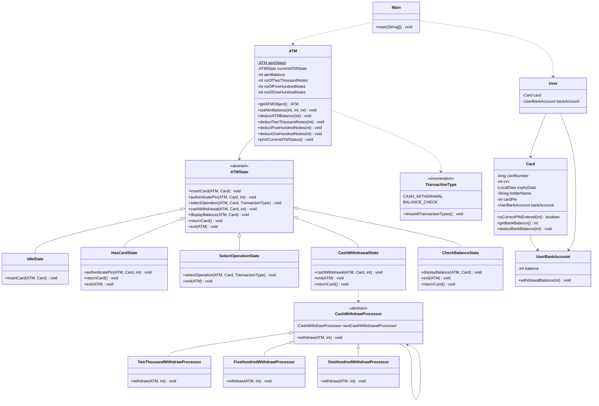

# ATM System Design

A comprehensive ATM (Automated Teller Machine) system implementation using Java, demonstrating key design patterns including State Pattern and Chain of Responsibility Pattern.

## Features

- **Cash Withdrawal**: Support for multiple denominations (₹2000, ₹500, ₹100)
- **Balance Inquiry**: Check account balance
- **PIN Authentication**: Secure PIN-based authentication
- **State Management**: Proper ATM state transitions
- **Error Handling**: Insufficient funds validation

## Design Patterns Used

### 1. State Pattern
Manages ATM states and valid transitions:
- `IdleState`: Initial state, accepts card insertion
- `HasCardState`: Card inserted, awaits PIN authentication
- `SelectOperationState`: PIN verified, operation selection
- `CashWithdrawalState`: Handles cash withdrawal
- `CheckBalanceState`: Displays account balance

### 2. Chain of Responsibility Pattern
Handles cash dispensing with different denominations:
- `TwoThousandWithdrawProcessor`: Processes ₹2000 notes
- `FiveHundredWithdrawProcessor`: Processes ₹500 notes
- `OneHundredWithdrawProcessor`: Processes ₹100 notes

### 3. Singleton Pattern
Ensures single ATM instance throughout the application.

### 4. Builder Pattern
Used for creating `User` and `Card` objects with optional parameters.

## Project Structure

```
src/main/java/org/deepak/
├── dto/
│   ├── processors/          # Chain of Responsibility processors
│   │   ├── CashWithdrawProcessor.java
│   │   ├── TwoThousandWithdrawProcessor.java
│   │   ├── FiveHundredWithdrawProcessor.java
│   │   └── OneHundredWithdrawProcessor.java
│   ├── states/              # State pattern implementations
│   │   ├── ATMState.java
│   │   ├── IdleState.java
│   │   ├── HasCardState.java
│   │   ├── SelectOperationState.java
│   │   ├── CashWithdrawalState.java
│   │   └── CheckBalanceState.java
│   ├── ATM.java             # Main ATM class
│   ├── Card.java            # Card entity
│   ├── User.java            # User entity
│   ├── UserBankAccount.java # Bank account entity
│   └── TransactionType.java # Transaction types enum
└── Main.java                # Application entry point
```

## How to Run

1. **Prerequisites**: Java 21+ and Maven
2. **Build**: `mvn clean compile`
3. **Run**: `mvn exec:java -Dexec.mainClass="org.deepak.Main"`

## Usage Example

```java
// Initialize ATM with cash
ATM atm = ATM.getATMObject();
atm.setAtmBalance(1, 2, 5); // 1x₹2000, 2x₹500, 5x₹100

// Create user with bank account
UserBankAccount bankAccount = new UserBankAccount(3000);
User user = User.builder()
    .card(Card.builder().cardPin(112211).bankAccount(bankAccount).build())
    .bankAccount(bankAccount)
    .build();

// Perform ATM operations
atm.getCurrentATMState().insertCard(atm, user.getCard());
atm.getCurrentATMState().authenticatePin(atm, user.getCard(), 112211);
atm.getCurrentATMState().selectOperation(atm, user.getCard(), TransactionType.CASH_WITHDRAWAL);
atm.getCurrentATMState().cashWithdrawal(atm, user.getCard(), 2700);
```

## Class Diagram

View the detailed class diagram: [Class Diagram](class-diagram.md)



## Key Components

- **ATM**: Central controller managing state and cash inventory
- **Card**: Represents user's ATM card with PIN validation
- **User**: Card holder with associated bank account
- **UserBankAccount**: Manages user's account balance
- **ATMState**: Abstract state defining valid operations
- **CashWithdrawProcessor**: Abstract processor for cash dispensing

## Architecture Overview

The system follows a layered architecture with clear separation of concerns:

1. **Presentation Layer**: `Main` class handles user interaction
2. **Business Logic Layer**: State classes manage ATM operations
3. **Data Layer**: Entity classes (`User`, `Card`, `UserBankAccount`)
4. **Processing Layer**: Chain of Responsibility processors handle cash dispensing

## Technologies Used

- Java 21
- Maven
- Lombok (for reducing boilerplate code)
- SLF4J + Logback (for logging)
- Mermaid (for class diagrams)
